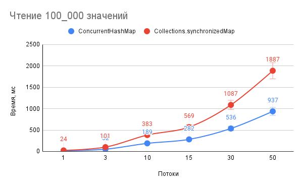
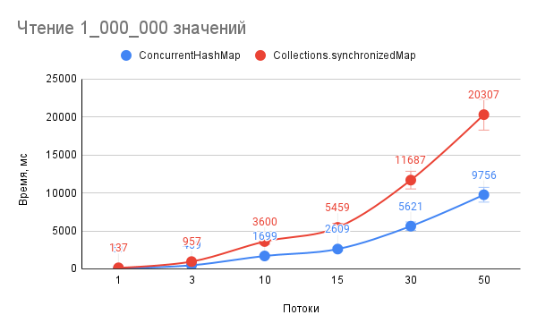
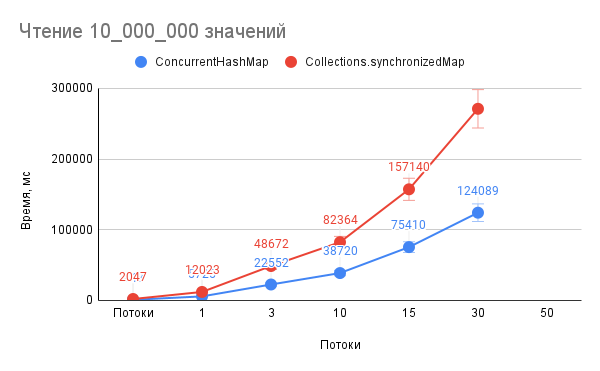
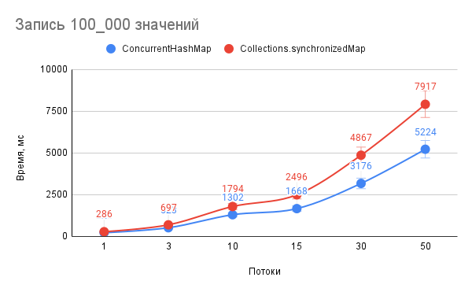
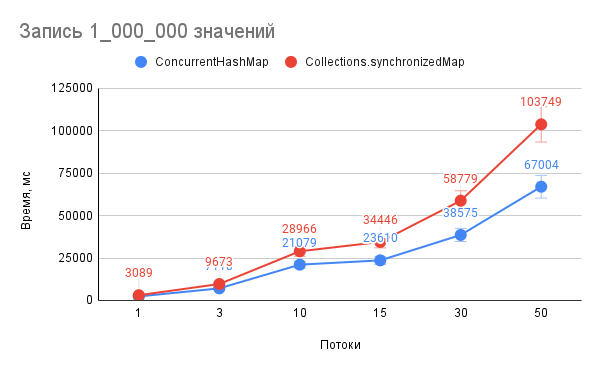
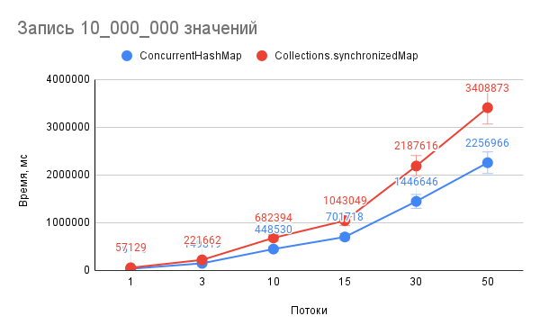

В результате сравнения производительности чтения и записи, между двумя структурами данных:
- ConcurrentHashMap; 
- Collections.synchronizedMap(new HashMap<>());

Можно сделать следующие выводы:
- ConcurrentHashMap работает быстрее чем Collections.synchronizedMap(new HashMap<>());
- ConcurrentHashMap в режиме чтения: 
- - на 100_000 операций чтения - в среднем быстрее от от 71% до 102%;
- - от 1_000_000 до 10_000_000 операций чтения - в среднем быстрее от от 108% до 124%;
- Collections.synchronizedMap(new HashMap<>()) - скорость чтения не значительно замедляется, на кратном увеличиение количество операций чтения;
- ConcurrentHashMap в режиме записи, в среднем быстрее от 27% до 54%
при кратном увеличение количества операций с 100_000 до 10_000_000 очевидного разрыва в производительности не замечено;
- оба типа данных теряют в производительности, при увеличении количества параллельных потоков;
- падение производительности операций чтения с увеличением потоков от 1 до 50 составило:
- - для ConcurrentHashMap от 66 до 159 раз, от 100_000 до 10_000_000 операций;
- - для Collections.synchronizedMap(new HashMap<>()) от 78 до 148 раз, от 100_000 до 10_000_000 операций;
- падение производительности операций записи с увеличением потоков от 1 до 50 составило:
- - для ConcurrentHashMap от 23 до 62 раз, от 100_000 до 10_000_000 операций;
- - для Collections.synchronizedMap(new HashMap<>()) от 27 до 59 раз, от 100_000 до 10_000_000 операций;

# Сравнительные графики тестирования производилось на компьютере с процссорм I5-7300HQ.

